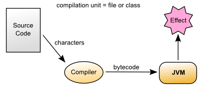
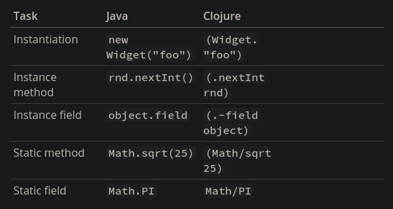

# Clojure Basics :ocean:

## Learn Clojure - Syntax

### Literals

Em clojure utilizamos o `;` como comentário. Para indicar um cabeçalho por exemplo, utilizaríamos multiplos ponto e vírgula. Mas isso é apenas uma convenção da linguagem.

#### Numeric types

```clojure
42		; integer
-1.5	; floating point
22/7	; ratio
```

Integers são interpretados como inteiros de 64-bits de precisão fixa (Java Long) quando estão dentro do alcance, caso o contrário, possuem uma precisão arbitrária (Clojure Big Int). Colocar um `N` no final do número pode ser usado para forçar uma precisão arbitrária.

Clojure também suporta a sintaxe de Java para octal (prefix `0`), hexadecimal (prefix `0x`), e raizes arbitrárias (prefix `r`). Ratios são fornecidos como seu próprio tipo combinando um numerador e um denominador.

Floating point values são lidos como floats de dupla precisão de 64-bits (Java Double), ou precisão arbitrária (Java Big Decimal) com o sufixo `M`. Notações exponenciais também são suportadas. Os valores `##Inf, ##-Inf, ##NaN` representam, respectivamente: Inifito positivo, Infinito negativo, e "not a number".

#### Character types

```clojure
"hello"		; string
\e			; character
#"[0-9]+"	; regex
```

Strings são contidas em aspas duplas, e podem ocupar múltiplas linhas. Caracteres individuais (chars) são representados com uma barra. Existem alguns caracteres especiais, como `\newline \spec \tab`. Também temos suporte a caracteres Unicode: `\uNNNN`, ou `\oNNNN`.

Regex são representados como um `#` seguido da expressão regular. Eles são por fim compilados em objetos `java.util.regex.Pattern`.

#### Symbols and idents

```clojure
map				; symbol
+				; symbol - most punctuation allowed
clojure.core/+	; namespaced symbol
nil				; null value
true false		; booleans
:alpha			; keyword
:release/alpha	; keyword with namespace
```

Símbolos são compostos de letras, números, e outras pontuações. São usados para referenciar a algo, como uma função, valor, namespace, etc. Símbolos também podem vir de outros namespaces, como foi demonstrado no exemplo acima.

Existem apenas três diferentes símbolos que são lidos diferente: `nil true false`.

Keywords começam com dois pontos, e sempre avaliam a si mesmos. São frequentemente usados como valores enumerados ou nomes de atributos em Clojure.

#### Literal collections

Clojure também inclui quatro tipos de coleções:

```clojure
'(1 2 3)		; list
[1 2 3]			; vector
#{1 2 3}		; set
{:a 1, :b 2}	; map
```

Listas são basicamente linked lists, onde cada elemento é um node, contendo um apontamento para o próximo elemento em memória, bem como o próprio valor do elemento.

Os itens de um Vetor em Clojure são armazenados como uma árvore de nodes. Isso permite um acesso aleatório consideravelmente melhor se comparado com as Listas.

Maps são os tão conhecidos Hash Maps, ou Dicionários, possuindo então key/value pairs.

Sets são essencialmente Listas onde os valores não se repetem. Ou seja, não permitem valores dupilicados.


### Evaluation

Agora, vamos considerar como é a leitura e avaliação de expressões em Clojure.

#### Java Evaluation 



#### Clojure Evaluation


Em Clojure o código fonte é lido como caracteres pelo [Leitor](https://clojure.org/reference/reader). O leitor por sua vez pode ler o código tanto de um arquivo `.clj`, ou ser fornecido com uma série de instruções interativamente. O leitor então produz Clojure data, e finalmente, o compilador Clojure produz o bytecode para a JVM. 

#### Structure vs Semantics

Vamos considerar a seguinte expressão:


Esse diagrama ilustra a diferença entre sintaxe em verde (Clojure data structure produzida pelo Leitor), e semântica em azul (como os dados são compreendidos pelo Clojure runtime).

A maioria das formas em Clojure se avaliam por si próprias, com exceção de símbolos e listas. Símbolos são usados para referenciar alguma outra coisa, e quando avaliados, retornam o que eles originalmente estão referenciando. Já listas são avaliadas na sua invocação.

Considerando a avaliação da expressão acima:

* 3 e 4 avaliam a si mesmos (longs).
* `+` avalia para uma função que implementa de fato a operação `+`.
* avaliando a lista, será invocado a função `+` com 3 e 4 como argumentos.

Muitas linguagens possuem ambos statements e expressões, onde statements tem algum efeito, mas não retornam um valor. Em Clojure, tudo é uma expressão que avalia para um valor. Algumas expressões (mas não a maioria) também possuem efeitos.

Agora, vamos ver como podemos avaliar expressões interativamente em Clojure.

#### Delaying evaluation with quoting

Algumas vezes, será necessário suspender a avaliação, em particular para simbolos e listas. Muitas vezes um simbolo deve somente ser um simbolo, sem ter para o que referenciar:

```clojure
user=> 'x
x
```

E algumas vzes, uma lista deve ser somente uma lista com valores, não um código a ser avaliado:

```clojure
user=> '(1 2 3)
(1 2 3)
```


### REPL

REPL significa Read-Eval-Print-Loop (Ler, Avaliar, Printar, Loopar). O REPL tem as seguintes partes:

1. Lê uma expressão (uma string de caracteres) para produzir Clojure Data.
2. Avalia os dados retornados do 1 passo para produzir um resultado (também Clojure Data).
3. Printa o resultado da conversão de dados para caractere.
4. Repete tudo de novo.

Um aspecto importante da parte 2 é que Clojure sempre compila a expressão antes de executá-la: Clojure é sempre compilado para bytecode da JVM. Não existe um interpretador de Clojure.


### Clojure Basics

#### def

Quando se está avaliando algo no REPL, pode ser útil salvar um pedaço de dados para depois. É possível realizar tal operação utilizando `del`:

```clojure
user=> (def x 7)
#'user/x
```

`def` é uma forma especial dentro de Clojure, que associa um símbolo (x) para o atual namespace com um valor (7). Esse ligamento é chamado de `var`.  Em Clojure, na maioria dos casos, vars são utilizadas para referenciar para valores constantes, ou uma função.

Algo a se atentar também é o retorno de def  `#'user/x` - isso é a representação literal de uma var: `#'` seguido do namespace.

#### Printing

Clojure nos oferece diversas funções para printar valores:

```
					For humans		Legível como dado
					
Com nova linha:		println			prn

Sem nova linha:		print			pr
```

A parte "para humanos" vai traduzir caractere especiais (como nova linhas e tabs), e emitir as aspas das strings. 

```clojure
user=> (println "What is this:" (+ 1 2))
What is this: 3
```

Para uma visualização mais bruta de seus dados, use funções como `prn`:

```clojure
user=> (prn "one\n\ttwo")
"one\n\ttwo"
```


## Learn Clojure - Functions

### Creating Functions

Clojure é uma **linguagem funcional.** Funções são **first-class** (primeira classe), e podem ser passadas para, ou retornadas de outras funções. A maior parte do código que você escreverá será composto de **funções puras** (sem side effects). `defn` pode ser usado definir uma função:

```clojure
;;	  name	params		 body
(defn greet [name] (str "Hello, " name))

;; calling the function
(greet "students")
;; output
"Hello, students"
```

 #### Multi-arity functions

Funções podem ser definidas para receberem diferentes números de parâmetros (diferentes "arity"). Diferentes aridades (arities) devem ser definidos no mesmo `defn` - usar `defn` mais de uma vez irá substituir a função anterior.

Cada aridade é uma lista `([param*] body*)`, uma aridade pode invocar a outra, e o corpo pode conter quantas expressões forem precisas. O retorno será sempre o resultado da última expressão do corpo.

```clojure
(defn messenger
    ([] (messenger "Hello world!"))
    ([msg] (println msg)))
```

Essa função está declarando duas aridades (zero parâmetros, e um parâmetro). A aridade-0 chama a aridade-1 com um valor padrão para ser printado. Podemos invocar essas funções da seguite forma:

```clojure
user=> (messenger)
Hello world!
nil

user=> (messenger "Hello class!")
Hello class!
nil
```

#### Variadic functions

Funções também podem declarar um número variável de parâmetros - isso é chamado de uma função variável. Os parâmetros variáveis são definidos através do símbolo `&`, e devem ocorrer no final da lista de parâmetros:

```clojure
(defn hello [greeting & who]
    (println greeting who))

(hello "Hello" "world" "class")
Hello (world class)
```

É possível visualizar que no output da função é printado `who` como uma lista de dois elementos.

#### Anonymous functions

Uma função anônima pode ser criada com `fn`:

```clojure
;;  params    body
(fn [msg] (println msg))
```

Por uma função anônima não possuir um nome (por isso ela é anônima), não é possível chama-lá novamente no programa. Ela normalmente serve apenas a um propósito simples, como por exemplo, ser o parâmetro para alguma outra função mais complexa.

Também é possível invocar imediatamente uma função anonima:

```clojure
((fn [msg] (println msg)) "Hello World")
```

Como já foi dito antes, muitas linguagens possuem ambos statements, que imperativamente fazem algo e não retornam um valor, e expressões que retornam de fato um valor. Em Clojure temos **apenas expressões**. É muito importante compreender isso para entender de fato como a linguagem funciona.

#### Anonymous function syntax

Existe uma forma mais curta de se utilizar uma função anônima: `#()`.  Essa sintaxe omite a lista de parâmetros, e se baseia na posição de cada um deles.

* `%` é usado para um único parâmetro.
* `%1`, `%2`, `%3`, etc são usados para múltiplos parâmetros.
* `%&` é usado para parâmetros variáveis.

Funções anônimas juntas criariam uma certa ambiguidade, já que os parâmetros não são nomeados, então nesting não é permitido.

```clojure
;; Equivalent to: (fn [x] (+ 6 x))
#(+ 6 %)

;; Equivalent to: (fn [x y] (+ x y))
#(+ %1 %2)

;; Equivalent to: (fn [x y & zs] (println x y zs))
#(println %1 %2 %&)
```

Um erro comum quando se utilizando funções anônimas em Clojure, é colocar o parâmetro `%` como um vetor, na esperança de definir um vetor. 

```clojure
;; DO NOT DO THIS
#([%])
```

Essa declaração é equivalente a:

```clojure
(fn [x] ([x]))
```

Isso resultará na invocação do vetor sem nenhum argumento. Ao invés, faça desta forma:

```clojure
#(vector %)

;; or this
(fn [x] [x])

;; or most simply just use the vector function itself:
vector
```


#### defn vs fn

`defn` não passa de uma contração de `def` e `fn`. Como a definição de funções é algo muito comum, foi inventado o `defn` para encurtar esse processo:

```clojure
(defn greet [name] (str "Hello, " name))

(def greet (fn [name] (str "Hello, " name)))
```


### Appying Functions

#### apply

A função `apply` invoca uma função com 0 ou mais argumentos fixos. O argumento final de uma função `apply` deve ser uma sequência:

```clojure
(apply f '(1 2 3))		;; same as (f 1 2 3)
(apply f 1 '(2 3))		;; same as (f 1 2 3)
(apply f 1 2 '(3))		;; same as (f 1 2 3)
```

Todas essas chamadas são equivalentes a `(f 1 2 3)`. `apply` é útil quando argumentos são passados como sequências, mas você deve invocar uma função com os valores dessa sequência.

Por exemplo, é possível utilizar `apply` para evitar escrever isso:

```clojure
(defn plot [shape coords]	;; coords is [x y]
    plotxy shape (first coords) (second coords))
```

Ao invés, você pode escrever assim:

```clojure
(defn plot [shape coords]
    (apply plotxy shape coords))
```

No caso acima, apply já pegaria todos os itens da sequência coords, e passaria na função plotxy.


### Locals and Closures

#### let

`let` vincula simbolos para valores em um "lexical scope". Um escopo léxico cria um novo contexto para os nomes, dentro do contexto envolvente. Basicamente simbolos declarados dentro de `let` funcionaram apenas dentro daquele escopo.

```clojure
;;	    bindings	 name is defined here
(let [name "Gabriel"] (prinln name))
```

Cada `let` pode definir 0 ou mais víncolos, e pode ter 0 ou mais expressões no seu corpo.

```clojure
(let [x 1
      y 2]
  (+ x y))
```

Se tentarmos referênciar uma expressão let fora do escopo da mesma, o compilador reportará um erro.

#### Closures

A forma especial `fn` cria um fechamento (closure). Ele fecha sobre o escopo lexical ao redor, e captura seus valores além do escopo lexical.

```clojure
(defn messenger-builder [greeting]
    (fn [who] (println greeting who))) ; closes over greeting

;; greeting provided here, then goes out of scope
(def hello-er (messenger-builder "Hello"))

;; hello-er becomes a function
;; greeting value still available because hello-er is a closure
(hello-er "world")
Hello world
```

No exemplo acima, hello-er se torna uma função, e o valor de greeting passado na definição do símbolo permanece armazenado mesmo na invocação de hello-er. 


### Java Interop

#### Invoking Java code

Abaixo está o resumo da chamada de códigos Java em Clojure:



#### Java Methods vs Functions

* Métodos Java não são funções Clojure.
* Não é possível armazená-los ou passá-los como argumento.
* É possível envolvê-los em funções quando necessário.

```clojure
;; make a function to invoke .length on arg
(fn [obj] (.length obj))

;; same thing
#(.length %)
```


## Learn Clojure - Sequential Collections

Coleções em Clojure "coletam" valores, e formam um valor composto. Existem quatro tipos principais de coleções: **Vetores**, **Listas**, **Sets**, e **Maps**. Desses quatro, apenas vetores e listas são ordenados.


### Vectors

Vetores são uma estrutura de dados sequencial indexada. São representados com `[]`: 

```clojure
[1 2 3]
```

#### Indexed access

Como em Java, nossos vetores em Clojure iniciam com o índice em 0. Sabendo disso, podemos pegar um valor de um vetor utilizando a função `get`, e passando o index desejado:

 ```clojure
 (def vect [1 2 3 4 5])
 (get vect 0)
 1
 ```

Se tentarmos acessar um index que não existe, será retornado `nil`.

#### count

Todas coleções em Clojure podem ser contadas:

```clojure
(count [1 2 3])
3
```

#### Constructing

Além da declaração com `[]`, também podemos criar vetores utilizando a função `vector`:

```clojure
(vector 1 2 3)
[1 2 3]
```

#### Adding elements

Elementos podem ser adicionados com a função `conj` (abreviação para conjoin). Elementos são sempre adicionados no final do vetor:

```clojure
(conj [1 2 3] 4 5 6)
[1 2 3 4 5 6]
```

#### Immutability

Como outros valores em Clojure, como strings, numbers, vetores também são imutáveis.

Por exemplo, vamos criar um vetor e aplicar a função `conj` nele:

```clojure
(def v [1 2 3])
(conj v 4 5 6)
[1 2 3 4 5 6]
```

Aqui, `conj` nos retornou um novo vetor. Ou seja. se checarmos, o nosso vetor original permanece imutado.

Qualquer função que mude uma coleção retorna uma nova instância. 


### Lists

Listas são linked lists sequenciais, que adicionam novos elementos no começo (head) da lista, ao invés do final (tail), como em vetores.

#### Constructing

Por conta de listas serem avaliadas invocando o primeiro elemento como uma função, precisamos acrescentar uma aspas `'` no começo da definição, para evitar a avaliação:

```clojure
(def cards '(10 :ace :jack 9))
```

Listas não são indexadas, então elas precisam ser acessadas através de `first`, e `rest`:

```clojure
(first cards)
10
(rest cards)
'(:ace :jack 9)
```

#### Adding elements

`conj` pode ser usado para adicionar elemtnos em listas, da mesma forma como em Vetores. Porém,  `conj` adiciona elementos onde for possível em tempo constante (constant time) para a estrutura de dados. No caso de listas, os elementos são adicionados no começo dela: 

```clojure
(conj cards :queen)
(:queen 10 :ace :jack 9)
```

#### Stack access

Listas também podem ser utilizadas como pilhas, com `peek`, e `pop`:

```clojure
(def stack '(:a :b))
(peek stack)
:a
(pop stack)
(:b)
```


## Learn Clojure - Hashed Collections

Neste tópico vamos nos aprofundar nas estruturas de dados **sets** e **maps**, que são eficientes para a pesquisa de elementos.


### Sets

Sets (ou conjuntos) são como conjuntos matemáticos - não ordenados, e sem duplicatas. Sets são ideias para checar com eficiência se uma coleção contém um certo elemento, ou remover qualquer elemento arbitrário.

Podemos definir sets da seguinte forma:

```clojure
(def players #{"Alice", "Bob", "Kelly"})
```

#### Adding to a set

Como com vetores e listas, `conj` também pode ser usado com sets.

```clojure
(conj players "Fred")
#{"Alice" "Bob" "Kelly" "Fred"}
```

#### Removing from a set

A função `disj` (abreviação para disjoin) é usada para remover um ou mais elementos de um set.

```clojure
(disj players "Bob" "Sal")
#{"Alice" "Kelly"}
```

#### Checking containment

Podemos utilizar a função com retorno boleano `contains?` para checar se um elemento existe dentro de um set.

```clojure
(contains? players "Kelly")
true
```

#### into

`into` é utilizado quando é necessário colocar uma coleção dentro de outra.

```clojure
(def players #{"Alice" "Bob" "Kelly"}) ; set
(def new-players ["Tim" "Sue" "Greg"]) ; vector
(into players new-players)
#{"Alice" "Greg" "Sue" "Bob" "Tim" "Kelly"}
```

A função `into` retorna um tipo de coleção do mesmo tipo que o primeiro argumento passado. No exemplo acima, um set.


### Maps

Maps são estruturas de dados baseadas em key/value pairs. Em outras linguagens, São conhecido como Dicionário, ou Hash Maps.

#### Creating a literal map

Maps são representados alternando entre chaves e valores, e são rodeados por `{}`:

```clojure
(def scores {"Fred" 1400
             "Bob" 1240
             "Angela" 1024})
```

#### Adding new key-value pairs

Novos valores são adicionados aos maps com a função `assoc` (abreviação de associate):

```clojure
(assoc scores "Sally" 0)
{"Angela" 1024, "Bob" 1240, "Fred" 1400, "Sally" 0}
```

Caso a key usada em `assoc` já exista, o valor é substituido:

```clojure
(assoc socres "Bob" 0)
{"Angela" 1024, "Bob" 0, "Fred" 1400}
```

#### Removing key-value pairs

A operação complementar para remover key-value pairs é o `dissoc` (abreviação de dissociate):

```clojure
(dissoc socres "Bob")
{"Angela" 1024, "Fred" 1400}
```

#### Looking up by key

Existem diversas formas de se procurar por um valor em um map. A mais óbvia seria utilizando a função `get`:

```clojure
(get scores "Angela")
1024
```

Quando o mapa em questão está sendo tratado como uma tabela de pesquisa constante, é comum se invocar o próprio mapa, tratando como uma função:

```clojure
(def directions {:north 0
                 :east 1
                 :south 2
                 :west 3})
(directions :north)
0
```

#### Looking up with a default

Se você desejar procurar por um valor, e, caso ele não existir, retornar um valor padrão, basta passar esse valor como um argumento adicional:

```clojure
(get scores "Sam" 0)
0

(directions :northwest -1)
-1
```

Usar um valor padrão de retorno é útil para diferenciar uma key inexistente, de uma key com o valor `nil`.

#### Checking contains

Existem duas outras funções que ajudam a checar se um mapa contem uma entrada: `contains?`, e `find`.

```clojure
(contains? scores "Fred")
true

(find scores "Fred")
["Fred" 1400]
```

#### Keys or values

Também é poissível pegar apenas as chaves ou os valores de um map:

```clojure
(keys scores)
("Fred" "Bob" "Angela")

(vals scores)
(1400 1240 1024)
```

#### Building a map

A função `zipmap` pode ser usada para zipar juntos duas sequências em um map:

```clojure
(def players #{"Alice" "Bob" "Kelly"}) ; set
(zipmap players (repeat 0))
{"Kelly" 0, "Bob" 0, "Alice" 0}
```

Existem outras formas também de se obter o mesmo resultado. Por exemplo:

```clojure
;; with map and into
(into {} (map (fn [player] [player 0]) players))

;; with reduce
(reduce (fn [m player]
            (assoc m player 0))
        {} ; initial value
        players)
```

#### Combining maps

A função `merge` pode ser usada para combinar múltiplos mapas em um único mapa:

```clojure
(def new-scores {"Angela" 300
                 "Jeff" 900})
(merge scores new-scores)
{"Fred" 1400, "Bob" 1240, "Jeff" 900, "Angela" 300}
```

No exemplo foram unidos dois maps, mas também é possível juntar mais do que dois.

Alternativamente, podemos utilizar `merge-with` para ao invés de substituir os valores, realizar alguma operação (como adição) com os mesmos:

```clojure
(def new-scores {"Fred" 550
                 "Angela" 900
                 "Sam" 1000})
(merge-with + scores new-scores)
{"Sam" 1000, "Fred" 1950, "Bob" 1240, "Angela" 1924}
```

#### Sorted maps

Maps ordenados podem ser feitos utilizando a função `sorted-map` na construção do mesmo.

```clojure
(def sm (sorted-map
         "Bravo" 204
         "Alfa" 35
         "Sigma" 99
         "Charlie" 100))
{"Alfa" 35, "Bravo" 204, "Charlie" 100, "Sigma" 99}

(keys sm)
("Alfa" "Bravo" "Charlie" "Sigma")

(vals sm)
(35 204 100 99)
```


### Representing application domain information

Quando precisamos representar muitas informações com o mesmo conjunto de campos conhecidos de antemão, podemos usar um map com keywords como chaves:

```clojure
(def person
    {:first-name "Kelly"
     :last-name "Keen"
     :age 32
     :occupation "Programmer"})
```

#### Field accessors

Podemos acessar valores dentro do nosso map da mesma forma como aprendemos anteriormente:

```clojure
(get person :occupation)
"Programmer"

(person :occupation)
"Programmer"
```

Mas na verdade, a forma mais comum de se acessar um valor por keyword, é invocando a própria keyword, visto que elas também são funções. Então, quando uma keyword é invocada, ela se procura dentro da estrutura de dados associativa que foi passada.

```clojure
(:occupation person)
"Programmer"
```

A invocação por keyword também tem um valor padrão opicional:

```clojure
(:favorite-color person "beige")
"beige" ;; if there is no favorite-color field in
		;; the person map, it will return beige
```

#### Updating fields

Podemos atualizar ou adicionar campos utilizando a função `assoc`:

```clojure
(assoc person :occupation "Baker")
{:age 32, :last-name "Keen", :first-name "Kelly", :occupation "Baker"}
```

#### Removing a field

Podemos usar `dissoc` para remover os campos:

```clojure
(dissoc person :age)
{:last-name "Keen", :first-name "Kelly", :occupation "Programmer"}
```

#### Nested entities

É muito comum vermos entidades dentro de outras entidades:

```clojure
(def company
    {:name "WidgetCo"
     :address {:street "123 Main St"
               :city "Sprtingfield"
               :state "IL"}})
```

Para acessar valores dentro de outros, podemos usar a função `get-in`:

```clojure
(get-in company [:address :city])
"Springfield"
```

E para modificar os campos, podemos usar `assoc-in` ou `update-in`:

```clojure
(assoc-in company [:address :street] "303 Broadway")
{:name "WidgetCo",
 :address
 {:state "IL",
  :city "Springfield",
  :street "303 Broadway"}}
```

#### Records

Uma alternativa para os maps nesses casos seria o uso de **records**. Records são feitos especificamente para situações assim, e normalmente possuem uma performance superior a de maps. 

Records são definidos com uma lista de campos para instâncias daquele record. Elas serão tratadas como keyword keys em cada instância.

```clojure
;; Define a record structure
(defrecord Person [first-name last-name age occupation])

;; Positional constructor - generated
(def kelly (->Person "Kelly" "Keen" 32 "Programmer"))

;; Map constructor - generated
(def kelly (map->Person
               {:first-name "Kelly"
                :last-name "Keen"
                :age 32
                :occupation "Programmer"}))
```


## Learn Clojure - Flow Control

### Statements vs. Expressions

Em java, uma expressão retorna um valor, já um statement não. Todavia, em Clojure tudo é uma expressão! **Tudo retorna um valor**, e um bloco de várias expressões, retorna o último valor (ou o resultado da última expressão). Já expressões que realizam side-effects retornam `nil`.


### Flow Control Expressions

Operadores de controle de fluxo são combináveis, logo podemos utilizar eles em qualquer lugar. Isso gera menos complicações durante o código.

Operadores de flow control também são extensíveis via macros. Para saber mais sobre macros, leia [Macros](https://clojure.org/reference/macros), ou [Clojure from the Ground Up](https://aphyr.com/posts/305-clojure-from-the-ground-up-macros), ou [Clojure for the Brave and True](http://www.braveclojure.com/writing-macros/).

#### if

A expressão condicional mais importante é o `if` - composto de uma condição, um *then*, e um *else*:

```clojure
(str "2 is " (if (even? 2) "even" "odd"))
						  ; true ; false
2 is even
(if (true? false) "impossible!") ;; else is optional
```

#### Truth

Em Clojure, todos os valores são falsos ou verdadeiros. Os únicos falsos são `false` e `nil` - todos os outros são logicamente true.

```clojure
(if true :truthy :falsey)
:truthy
(if (Object.) :truthy :falsey) ; objects are true
:truthy
(if [] :truthy :falsey) ; empty collections are true
:truthy
(if 0 :truthy :falsey) ; zero is true
:truthy
(if alse :truthy :falsey)
:falsey
(if nil :truthy :falsey)
:falsey
```

#### if and do

Nosso `if` aceita apenas uma expressão como *then*, e outra como *else*. Para criar largos blocos dentro de um `if`, podemos utilizar `do`:

```clojure
(if (even? 5)
    (do
        (println "even")
        (true)
     (do
         (println "odd")
         false))
```

#### when

A função `when` é basicamente um `if` com apenas o resultado de um *then*, sem o *else*. Ele checa uma condição, e depois avalia qualquer número de expressões como um corpo (então, não há necessidade para um `do`). E claro, a última expressão é retornada. Caso a condição resulte em false, `nil` é retornado.

```clojure
(when (neg? x)
    (throw (RuntimeException. (str "x must be positive: " x))))
```

#### cond

`cod` é uma série de condições, e expressões em ordem. Cada teste (condição) é avaliado em ordem, e a expressão é avaliada e retornada para o primeiro teste verdadeiro.

```clojure
(let [x 5]
    (cond
        (< x 2) "x is less than 2"
        (< x 10) "x is less than 10"))
```

#### cond and else

Se nenhum teste é retornado como verdadeiro, `nil` é retornado. Um uso comum de `cond` é incluir uma keyword como `:else` no final. Como keywords são sempre avaliadas para true, o teste será bem sucedido, e teremos assim um else dentro de nosso `cond`.

```clojure
(let [x 11]
    (cod
        (< x 2) "x is less than 2"
        (< x 10) "x is less than 10"
        :else "x is greater than or equal to 10"))
```

#### case

`case` compara um argumento para uma série de valores, até achar um valor correspondente. Isso é feito em tempo constante (não linear)! Entretanto, para atingir tal performance, os valores devem ser compile-time literal (numbers, strings, keywords, etc).

```clojure
(defn foo [x]
    (case x
        5 "x is 5"
        10 "x is 10"))

(foo 10)
x is 10
(foo 11) ; if the value passed does not match with any value in the case
         ; an exception is thrown
IllegalArgumentException No matching clause: 11
```

#### case with else-expression

Podemos inserir uma expressão final em case, fazendo assim um *else*. Com isso, podemos exitar uma exceção (exception).

```clojure
(defn foo [x]
    (case x
        5 "x is 5"
        10 "x is 10"
        "x isn't 5 or 10"))
```


### Iteration for Side Effects

#### dotimes

* Avalia uma expressão *n* vezes
* Retorna `nil` (puramente para Side Effects)

```clojure
(dotimes [i 3]
    println i))
0
1
2
nil
```

#### doseq

* Interage sobre uma sequência
* Se for uma lazy sequence, força a avaliação
* Retorna `nil`

```clojure
(doseq [n (range 3)]
    (println n))
0
1
2
nil
```

#### doseq with multiple bindings

* Similar a `foreach` loops
* Processa todas as permutações do conteúdo de sequência
* Retorna `nil`

```clojure
(doseq [letter [:a :b]
        number (range 3)]
    (prn [letter number]))
[:a 0]
[:a 1]
[:a 2]
[:b 0]
[:b 1]
[:b 2]
nil
```


### Clojure's for

* É um list comprehension, não um for-loop
* Função geradora (generator) para permutação de sequência
* As associações se comportam como em `doseq`

```clojure
(for [letter [:a :b]
      number (range 3)]
    [letter number])
([:a 0] [:a 1] [:a 2] [:b 0] [:b 1] [:b 2])
```


### Recursion

####  Recursion and Iteration

* Clojure nos possibilita o uso de `recur` e abstrações de sequências
* `recur` nada mais é do que uma recursão
* Sequências representam a interação como valores

#### loop and recur

* Functional looping construct
  * `loop` define certas ligações (bindings)
  * `recur` reexecuta `loop` com novas ligações

```clojure
(loop [i 0]
    (if (< i 10)
        (recur (inc i))
        i))
```

#### defn and recur

* Argumentos de funções são implicitamente ligações de `loop`

```clojure
(defn increase [i]
    (if (< i 10)
        (recur (inc i))
        i))
```

#### recur for recursion

* `recur` deve estar em "tail position"
  * A última expressão de uma ramificação
* `recur` deve providenciar valores para todos os símbolos vinculados por posição
  * Ligações (binding) de loops
  * Argumentos de defn/fn
* Recursão via `recur` não consome espaço na stack


### Exceptions

#### Exception handling

* Suporta `try` / `catch` / `finaly` como em Java

```clojure
(try
    (/ 2 1)
    (catch ArithmeticException e
        "divide by zero")
    (finally
        (println "cleanup")))
```

#### Throwing exceptions

```clojure
(try
    (throw (Exception. "something went wrong"))
    (catch Exception e (.getMessage e)))
```

#### Exceptions with Clojure data

* `ex-info` encaminha uma mensagem e um map
* `ex-date` recebe um map
  * Ou `nil` se não for criado com `ex-info`

```clojure
(try
    (throw (ex-info "There was a problem" {:detail 42}))
    (catch Exception e
        (prn (:detail (ex-data e)))))
```

#### with-open

```clojure
(let [f (clojure.java.io/writer "/tmp/new")]
    (try
        (.write f "some text")
        (finally
            (.close f))))

;; Can be written:
(with-open [f (clojure.java.io/writer "/tmp/new")]
    (.write f "some text"))
```


## Learn Clojure - Namespaces

### Namespaces and names

Namespaces nos dão a possibilidade de organizar melhor nosso código, e os nomes que usamos nele. Mais especificamente, eles nos possibilitam nomear funções ou outros valores com nomes claros, não ambíguos.

Um namespace é tanto um nome de contexto, quanto um container para vars. Namespaces são símbolos onde pontos são utilizados para a separação, como em `clojure.string`. Por convenção, namespaces são escritos em letra minúscula, e usam `-` para separar palavras.

#### Vars

Vars são as associações entre um nome (símbolo) e um valor. Vars em um namespace possuem um nome qualificado que é a combinação do nome do namespace, eo nome da var. Por exemplo, `clojure.string/join` - *clojure.string* é o nome do namespace, e *join* a var. Todas as vars são acessíveis globalmente através de seus nomes qualificados.

São criadas usando `def` e outra formas especiais, ou macros que começam com `def`, como `defn`. Vars são criadas no namespace atual onde são declaradas. Podemos alterar esse namespace utilizando a função `in-ns`.

#### Loading

Nomes de namespace também possuem uma convenção para onde o código em referência deve ser encontrado, ou carregado. Um caminho (path) é criado baseado no nome do namespace:

* Pontos se tornam separadores de diretórios
* Hífens se fornam underscores
* A extensão `.clj` é adicionada

Logo, o namespace  `com.some-example.my-app` é correspondente a `com/some_example/my_app.clj`. 

Existem muitas formas de se carregar um código em Clojure, porém a mais utilizada é através de `require`.

Devido a essa convenção de carregamento, a maior parte do código Clojure é estruturado em um map 1-para-1 de namespaces para arquivos.


### Declaring namespaces

A maioria dos arquivos Clojure representam um único namespace, e declaram as dependencias para aquele namespace no topo do arquivo usando o macro `ns`.

```clojure
(ns com.some-example.my-app
    "My app example"
    (:require
        [clojure.set :as set]
        [clojure.string :as str]))
```

O macro `ns` primeiramente especifica o nome do namespace, depois uma docstring opcional, e depois uma ou mais cláusulas declarando propriedades do namespace.

#### Refer

Por padrão, podemos invocar ou referenciar vars no namespace atual sem especificar o namespace (o namespace atual é considerado o padrão).

Adicionalmente, talvez você tenha percebido que não precisamos referenciar o namespace `clojure.core` para invocar certas funções contidas lá. A razão para tal é que as vars dessa biblioteca já foram referidas no atual namespace. `refer` faz uma entrada na atual tabela de símbolos do namescape que refere a vars de outros namespaces.

#### require

A classe `:require` corresponde a função `require`, que especifica um ou mais namespaces para serem carregados. Por exemplo, `require` pode fazer múltiplas coisas:

* Carregar (ou recarregar) um namespace.
* Opcionalmente vincular um *alias* que pode ser usado para referenciar a vars.
* Opcionalmente, refere a vars do namespace carregado para uso por nome não qualificado neste namespace.

Os dois últimos  tópicos são basicamente sobre fazer nomes fáceis de se utilizar em nosso código, para não precisarmos digitar mais do que o necessário. Podemos resumir isso como:

* `clojure.set` - apenas carrega o namespace `clojure.set`.
* `[clojure.set :as set]` - carrega e cria um *alias* `set` para o namespace `clojure.set`.
  * Isso possibilita a invocação de vars em `set`. Por exemplo: `set/union`, ao invés de `clojure.set/union`.
* `[clore.set :refer [union intersection]]` - carrega e refere a vars específicas do namespace.
  * Isso possibilita o uso de apenas `union` ao invés de `clojure.set/union`.

#### Java classes and imports

Em adição as vars, Clojure também tem suporte a classes Java. Classes Java podem sempre ser referidas usando seu nome "totalmente qualificado", como `java.util.Date`.

O macro `ns` também importa classes que ficam no package `java.lang`, para serem facilmente utilizados pelo nome da classe. Por exemplo, usar apenas `String` ao invés de `java.lang.String`.

Similar a `:refer`, o macro `ns` tem o `:import` que nos possibilita a importação de outras classes para serem usadas com nomes "não qualificados":

```clojure
(ns com.some-example.my-app2
    (:import
        [java.util Date UUID]
        	[java.io File]))
```

No exemplo demostrando acima, é importado a classe `Date`, e `UUID` do package `java.util`, e a classe `File` do package `java.io`.

