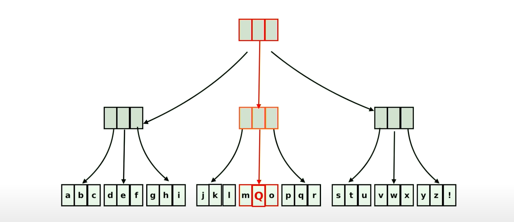

## Básico do paradigma de Programação Funcional (FP) :thinking:

### Funções:

A Programação funcional é muito fundamentada no conceito de funções. Porém, ao contrário da Programação Orientada a Objetos, as funções de FP (Functional Programming) são fortemente baseadas nas funções matemáticas `f(x)`.

Uma função matemática é relativamente simples: dado um input, é retornado um output. Por exemplo, se dado 5 a uma função para elevar ao quadrado, nos é retonardo 25. SImples, fácil, e limpo. Sem os chamados efeitos colaterais (veremos sobre isso futuramente) que uma função em OOP pode gerar. Isso é chamado de **funções puras**, ou **pure functions**.

Então, em programação funcional funções fazem aquilo que lhes é atribuído. Isso, e apenas isso. Funções nesse paradígma são mais do que simples "atalhos" ou "facilitadores" para nosso código. Funções são mais concretas, são valores manipuláveis. Ou seja, são consideradas como **first class functions**.


### Constantes e Mutações:

Dentro de FP todo dado é imutável. Isso significa que uma vez que sua variável foi definida, ela não terá o valor alterado. Vamos pegar um exemplo para demostrar isso:

```
-- Primeiramente, vamos definir uma array x.
x = [1, 2, 3]
-- Agora, vamos aplicar algumas funções em x.
y = a(b(x) + c(x))
-- Qual será o valor de x no final?
x = ?
-- Exatamente o mesmo! Nossos valores são imutáveis.
x = [1, 2, 3]
```

Agora, a programação ficaria completamente inviável se não pudessemos gerar novos valores. Então, como fazemos para gerar novos valores? Para isso, devemos simplesmente passar o novo desejado output para outra variável. Dessa forma, nosso antigo dado permanece imutado, e temos um novo dado com as características desejadas.

Todavia, isso com certeza pode gerar muitas complicações, principalmente com diferentes estruturas de dados. Por exemplo: Digamos que tenhamos uma array de 100 mil elementos em nosso programa. Seria completamente inviável copiar toda essa array, só para fazer uma mudança em um elemento. É aí que entra o nosso próximo tópico.


### Estruturas de Dados Persistentes:

Persistent Data Structures são basicamente versões das mais conhecidas estruturas de dados, como **arrays**, **hashes**, **lists**, **trees**, etc. Porém, elas possuem duas caracterísiticas notáveis:

* **1.** Imutáveis.
* **2.** Extremamente eficientes em cópias.

Vamos pensar no seguinte exemplo:



Dessa forma, nossa array fica dividida como em uma árvore, e cada "pedaço" da nossa array fica armazenada em um node diferente. Assim, caso for preciso criar uma nova array baseada nessa, alterando o vigésimo elemento por exemplo, será preciso apenas copiar um desses nodes, e conectar ele com os já existentes. Assim, podemos reutilizar nossos elementos, e criar uma nova array sem complicações.

Vale lembrar que no exemplo acima cada node está suportando apenas três elementos. Na realidade porém, uma estrutura de dados desse tipo suporta em média 32 itens.


### Funções Puras e Efeitos:

Dentro de uma função em outro paradigmas, podemos ter efeitos colaterais causados por ela. Por exemplo, a função pode alterar o valor de um elemento da array, ou até mesmo alterar um arquivo. Qualquer coisa que fuja do próposito básico da função (input -> output) pode ser considerado um **Side Effect**, ou simplesmente Efeito. E isso, como vimos anteriormente quebra o conceito de **Pure Functions**. 

Porém, a programação é muito envolvida com Side Effects. Muitas das coisas que os programas fazem são efeitos colaterais: atualizar um dado no banco de dados, modificar um arquivo...

É importante lembrar que o usuário final não se importa com os Efeitos Colaterais de um programa: ele apenas quer que a aplicação funcione como deveria. Quem se importa com o código por trás, na organização, e na legibilidade dele somos nós, desenvolvedores.

Então, cada linguagem de programação terá uma forma diferente de conciliar a programação funcional, com o mundo dos Efeitos Colaterais e Mutabilidade.


### Map, Filter, Reduce:

As funções **map**, **filter**, e **reduce** serão suas maiores aliadas na programação funcional. Vamos explicar uma a uma a funcionalidade:

* **Map**: "Mapeia" nossa array, aplicando uma função para cada elemento dela. Retorna uma nova array modificada.
* **Filter**: "Filtra" nossa array, com base em um parâmetro específico passado por nós. Também retorna uma nova array modificada.
* **Reduce**: "Reduz" nossa array em um elemento só. Com isso, podemos por exemplo, somar todos elementos em uma array com muita facilidade. Retorna um único dado, normalmente integers.

### Linguagens:

Algumas linguagens bem conhecidas de Programação Funcional: **Clojure**, **Haskell**, **Scala**, **LISP**, **ReasonML**, **Ocaml**, **F#**, **Elixir**, **Erlang**.

