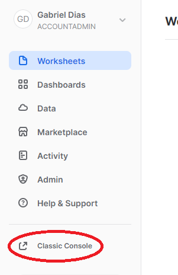
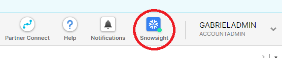
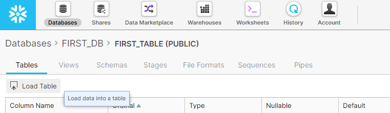
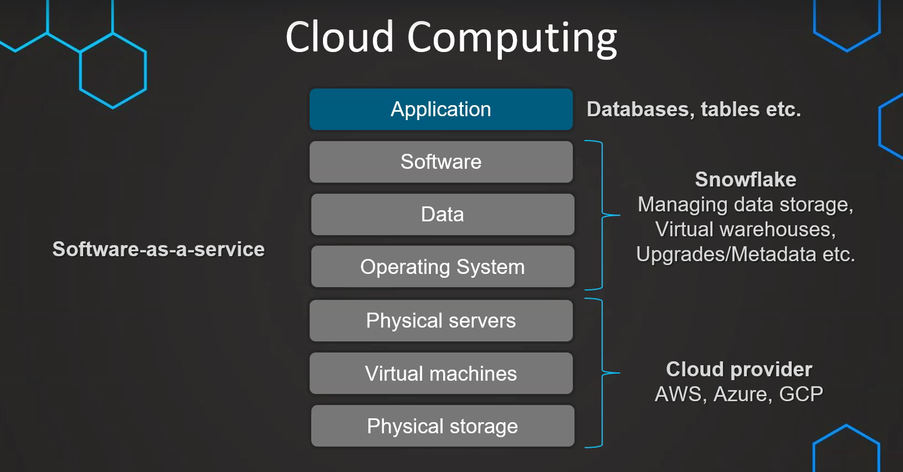
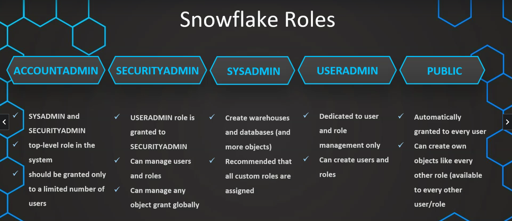
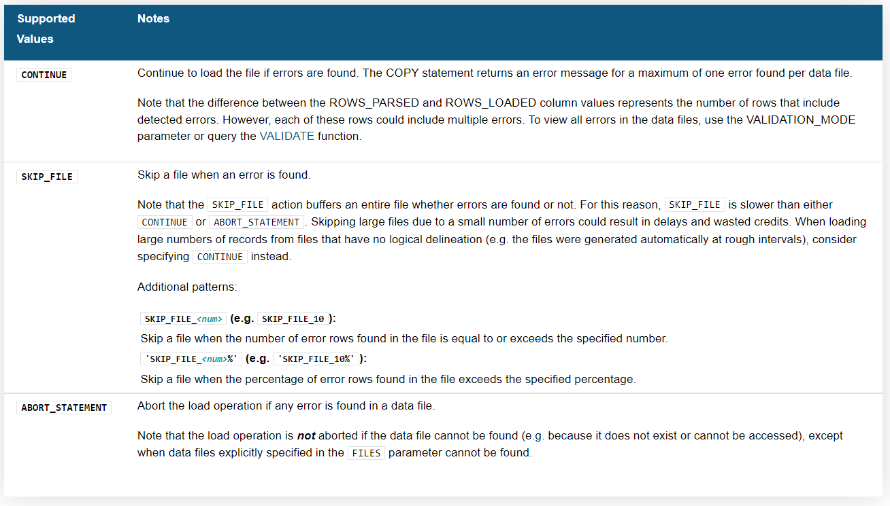
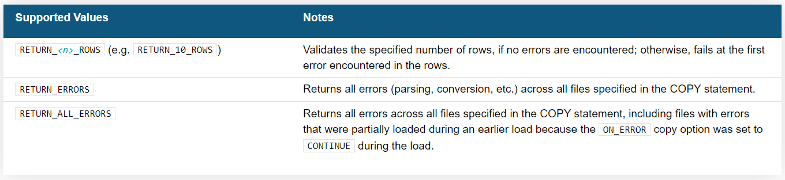

# Curso de snowflake

Anotações do curso [Snowflake - The Complete Masterclass (2022 Edition)](https://www.udemy.com/course/snowflake-masterclass/) realizado na plataforma Udemy.

## Getting Started

### Novo e antigo console

No webapp do Snowflake é possível transitar entre a nova interface, com sistema de autocomplete, e o antigo console (clássico).

* Para ir para o console antigo:
  
* Para a nova interface: 
  

### Carregamento de dados

Podemos carregar dados de arquivos internos no computador, como por exemplo um csv, e também de através de plataformas como AWS.

* Carregamento de dados internos:
  

* Carregamento de dados com bucket AWS:
  
  ```sql
// S3 bucket from lesson 12:
// s3://bucketsnowflakes3/Loan_payments_data.csv

CREATE TABLE LOAN_PAYMENT (
    "Loan_ID" STRING,
    "loan_status" STRING,
    "Principal" INTEGER,
    "terms" INTEGER,
    "effective_date" DATE,
    "due_date" DATE,
    "paid_off_time" STRING,
    "past_due_days" STRING,
    "age" INTEGER,
    "education" STRING,
    "Gender" STRING);

COPY INTO LOAN_PAYMENT
    FROM s3://bucketsnowflakes3/Loan_payments_data.csv
    file_format = (type = csv
                  field_delimiter = ','
                  skip_header = 1);

```
Também é válido mencionar dois métodos principais utilizados no carregamento de dados: o **Bulk loading** (mais utilizado, bom para altas quantidades de dados, e possui o comando COPY), e o **Continuous loading** (menos utilizado, bom para pequenas quantidades de dados, e possui a feature serverless snowpipe). Posteriormente esses métodos serão aprofundado em mais detalhes.

## Snowflake Architecture

### Data Warehouses
Uma DW é a integração e consolidação de diferentes DBs, ou seja, são diversos DBs juntos. Isso é feito para que futuramente esses DBs sejam utilizados para análise.  
Então basicamente o DW é um amontoado de dados providos de diferentes fontes, que podemos utilzar para reportes e análises.

O processo de criação de uma DW é chamado de **ETL** (Extract, Transform & Load).

Etapas para o carregamento de dados em um DW:
1. **Raw data ou Staging area:** Extração dos dados puros sem transformações, da fonte para o Data Warehouse.
2. **Data integration ou Data Transformation:** A integração dos dados é marcada pela criação de relacionamento entre as diferentes Tabelas e Bancos, bem como a remoção de dados desnecessários, e transformação dos dados existentes. No final dessa etapa o dado deve estar transformado, limpo, e devidamente integrado.
3. **Access layer:** Processo de criação de acessibilidade e disponibilidade dos dados para diferentes propósitos. Por exemplo, para a utilização de times de Data Science, Machine Learning, bem como para reportes dos dados e utilização de outras ferramentas analíticas.

Essas são as 3 etapas para o carregamento dos dados. Aqui na Sanofi, chamamos a camada, ou etapa de *Raw data* de *STG*, *Data Integration* de *PSA* e *Access Layer* de *DWH*.

### Cloud Computing
A computação em nuvem surgiu por conta do custo e da dificuldade de se manter um servidor, o que não chega a ser viável dependendo da empresa. Com servidores de terceiros, as empresas podem focar no seu software e aplicações, sem ter que se preocupar com manutenção de servidores próprios.
Algo válido de se mencionar também são os Cloud Providers: são eles que cuidam dos servidores físicos, máquinas virtuais, bem como do hardware dos equipamentos. Alguns dos Cloud Providers mais utilizados são AWS, Azure e GCP. 

### Software as a Service (SaaS)
O modelo SaaS tem ganhado muita popularidade ultimamente. Nesse modelo, o sistema não é comercializado como um produto, mas sim como serviço, como o próprio nome sugere. Assim, não é feita a instalação de nenhum programa nos equipamentos e as aplicações são usadas pela internet. O Snowflake, por exemplo, é um SaaS.
Nesse modelo o cliente paga pela assinatura do serviço oferecido (o acesso) e não por um produto, o que elimina o custo com a aquisição de licenças.



### Snowflake roles
No Snowflake temos diferentes roles, que dão diferentes permissões para os usuários.



## Loading Data

### Stages para carregamento de dados
Os stages que utilizamos no carregamento de dados nada mais são do que a localização dos dados que serão carregados. Eles podem ser internos (armazenamento local do próprio Snowflake) ou externos (S3 buckets, Google Cloud Platform, Microsoft Azure).

Para criar um stage externo, utilizamos os seguintes comandos:
```sql
// Db to manage stage objects, file formats, etc.
CREATE OR REPLACE DATABASE MANAGE_DB;
CREATE OR REPLACE SCHEMA external_stages;

// External stage
CREATE OR REPLACE STAGE MANAGE_DB.external_stages.aws_stage
   url = 's3://bucketsnowflakes3'
   credentials = (aws_key_id = 'ABCD_DUMMY_ID' aws_secret_key = '1234abcd_key');
```

Alguns outros comandos úteis para manipulação do stage:

```sql
// Description of external stage
DESC STAGE MANAGE_DB.external_stages.aws_stage;

// Alter external stage
ALTER STAGE MANAGE_DB.external_stages.aws_stage
    SET credentials = (aws_key_id = 'XYZ_DUMMY_ID' aws_secret_key = '987xyz')

// Public accessible staging area (no credentials)
CREATE OR REPLACE STAGE MANAGE_DB.external_stages.aws_stage
    url = 's3://bucketsnowflakes3';

// List files in stage
LIST @MANAGE_DB.external_stages.aws_stage
```

### Copy command

Para de fato carregarmos os dados que estão em um stage externo, podemos utilizar o comando **Copy**:

```sql
// Creating table to receive the data
CREATE TABLE FIRST_DB.PUBLIC.ORDERS (
    ORDER_ID VARCHAR(30),
    AMOUNT INT,
    PROFIT INT,
    QUANTITY INT,
    CATEGORY VARCHAR(30),
    SUBCATEGORY VARCHAR(30)
);

// Copy command
COPY INTO FIRST_DB.PUBLIC.ORDERS
    FROM @MANAGE_DB.external_stages.aws_stage
    file_format = (type = csv field_delimiter = ',' skip_header = 1)
    files = ('OrderDetails.csv');
    // Or we could use pattern matching for looking for our files:
    // pattern = ('*.csv')
```

É válido mencionar também que o Snowflake armazena metadados dos nossos carregamentos de dados. Com isso, por uma medida de segurança. não é permitido o carregamento duplicado de dados. Ou seja, caso o comando copy seja rodado novamente para o mesmo arquivo, os dados não serão carregados uma segunda vez.

Com o comando Copy, também temos a possibilidade de transformar os dados antes de inserí-los em uma tabela:

```sql
CREATE OR REPLACE TABLE FIRST_DB.PUBLIC.ORDERS_EX (
    ORDER_ID VARCHAR(30),
    AMOUNT INT,
);


COPY INTO FIRST_DB.PUBLIC.ORDERS_EX
    FROM (select s.$1, s.$2 from @MANAGE_DB.external_stages.aws_stage s)
    file_format = (type=csv field_delimiter=',' skip_header=1)
    files = ('OrderDetails.csv');
```

Neste exemplo estamos selecionando as colunas 1 e 2 do arquivos `OrderDetails.csv`. Podemos utilizar em casos mais avançados, com os [subsets de funções SQL disponíveis no Snowflake]([Transforming Data During a Load — Snowflake Documentation](https://docs.snowflake.com/en/user-guide/data-load-transform.html#supported-functions)):

### Trasformando dados no carregamento

Podemos fazer transformações nos dados que carregamos usando o comando `copy`. Por exemplo, para selecionar apenas algumas colunas do arquivo, faríamos:

```sql
CREATE OR REPLACE TABLE FIRST_DB.PUBLIC.ORDERS_EX (
    ORDER_ID VARCHAR(30),
    AMOUNT INT
)
COPY INTO FIRST_DB.PUBLIC.ORDERS_EX
    FROM (select s.$1, s.$2 from @MANAGE_DB.external_stages.aws_stage s)
    file_format=(type = csv field_delimiter = ',' skip_header = 1)
    files=('OrderDetails.csv');
```

Também é possível carregar dados para apenas algumas colunas em específico da nossa tabela (subset de colunas):

```sql
CREATE OR REPLACE TABLE FIRST_DB.PUBLIC.ORDERS_EX (
    ORDER_ID VARCHAR(30),
    AMOUNT INT,
    PROFIT INT
)

COPY INTO FIRST_DB.PUBLIC.ORDERS_EX (ORDER_ID, PROFIT)
    FROM (select s.$1, s.$3 from @MANAGE_DB.external_stages.aws_stage s)
    file_format=(type = csv field_delimiter = ',' skip_header = 1)
    files=('OrderDetails.csv');
```

Dentro dos comandos `copy` para a transformação de dados também podemos utilizar um subset de funções SQL. Para consultar todas as funções SQL disponíveis, podemos acessar a [documentação do Snowflake](https://docs.snowflake.com/en/user-guide/data-load-transform.html#supported-functions).

```sql
CREATE OR REPLACE TABLE FIRST_DB.PUBLIC.ORDERS_EX (
    ORDER_ID VARCHAR(30),
    AMOUNT INT,
    PROFIT INT,
    PROFITABLE_FLAG VARCHAR(30),
);

-- Ex 01
COPY INTO FIRST_DB.PUBLIC.ORDERS_EX
    FROM (select
            s.$1,
            s.$2,
            s.$3,
            CASE WHEN CAST(s.$3 as int) < 0 THEN 'not profitable' ELSE 'profitable' END
        from @MANAGE_DB.External_stages.aws_stage s)
    file_format = (type=csv field_delimiter=',' skip_headers=1)
    files=('OrderDetails.csv');


CREATE OR REPLACE TABLE FIRST_DB.PUBLIC.ORDERS_EX (
    ORDER_ID VARCHAR(30),
    AMOUNT INT,
    PROFIT INT,
    CATEGORY_SUBSTRING VARCHAR(5),
);

-- Ex 02
COPY INTO FIRST_DB.PUBLIC.ORDERS_EX
    FROM (select
            s.$1,
            s.$2,
            s.$3,
            substring(s.$5, 1, 5)
        from @MANAGE_DB.External_stages.aws_stage s)
    file_format = (type=csv field_delimiter=',' skip_headers=1)
    files=('OrderDetails.csv');
);
```

### File Format Object

Até agora nós especificamos qual o formato do arquivo que estávamos carregando no comando `copy` manualmente, através da propriedade `file_format`. Porém, também podemos definir um File Format Object, e reutilizá-lo em vários lugares:

```sql
CREATE OR REPLACE SCHEMA MANAGE_DB.file_formats;

CREATE OR REPLACE FILE FORMAT MANAGE_DB.file_formats.csv
    TYPE = CSV
    FIELD_DELIMITER = ','
    SKIP_HEADER = 1;
```

Agora para utilizar o file format recém criado, precisamos apenas especificar o `format_name` dentro da propriedade `file_format`:

```sql
COPY INTO FIRST_DB.PUBLIC.ORDERS
    FROM @MANAGE_DB.external_stages.aws_stage
    file_format = (format_name=MANAGE_DB.file_formats.csv)
    files = ('OrderDetails.csv');
```

Também podemos fazer outras coisas com nossos file formats, como alterar suas propriedades, e ver sua descrição (overview das propriedades):

```sql
DESC FILE FORMAT MANAGE_DB.file_formats.csv;

ALTER FILE FORMAT MANAGE_DB.file_formats.csv
    SET FIELD_DELIMITER = '|';
```

## Copy Options

### Diferentes opções

Além das propriedades padrões como `FILES` e `FILE_FORMAT`, também podemos adicionar outras propriedades opcionais para nosso copy command. Elas serão utilizadas para personalizar nosso comando, tornando ele mais versátil para diferentes situações. Aqui estão algumas das opções mais importantes que podemos utilizar em nosso comando copy (para maiores detalhes sobre as opções, olhe a [documentação oficial do snowflake](https://docs.snowflake.com/en/sql-reference/sql/copy-into-table.html#copy-options-copyoptions):

* **ON_ERROR:** Especificação para casos de erro no carregamento dos dados. Temos como opções `CONTINUE`, `SKIP_FILE` e `ABORT_STATEMENT`.



* **RETURN_FAILED_ONLY:** Normalmente utilizado em conjunto com `ON_ERROR`, serve para especificar o retorno de apenas arquivos que falharam no carregamento. Temos como opções `TRUE` ou `FALSE`.
* **VALIDATION_MODE:** Forma de debug ou validação do comando copy. Adicionando um modo de validação, os dados não serão propriamente carregados, mas apenas testados para saber se o carregamento será bem sucedido ou não. Temos como opções `RETURN_<n>_ROWS`, `RETURN_ERRORS` e `RETURN_ALL_ERRORS`.



* **SIZE_LIMIT:** Especifica um tamanho máximo em bytes para ser carregado. Vale lembrar que independentemente do tamanho máximo definido, o primeiro arquivo será sempre carregado. Porém, caso o valor exceda logo no primeiro arquivo, o segundo e todos os outros arquivos especificados não serão carregados.
* **TRUNCATECOLUMNS:** Serve para truncar ou não as colunas de string, varchar ou texto na nossa tabela. Por exemplo, se tivermos uma coluna com o tipo de dado especificado para `VARCHAR(10)`, e no carregamento de dados alguma linha do arquivo ultrapassar esse limite de dez caracteres, com a opção `TRUNCATECOLUMNS` acionada evitaremos um erro e carregaremos apenas os dez primeiros caracteres nesse caso. Temos como opções `TRUE` ou `FALSE`.
* **FORCE:** Força o carregamento de arquivos mesmo se eles já tenham sido carregados antes e não tenham mudado desde então, o que pode gerar duplicamento de dados. Temos como opções `TRUE` ou `FALSE`.

### Histórico de carregamento

Dentro do Snowflake, conseguimos acessar o histórico do carregamento de dados feito com o comando `COPY INTO <table>` através do schema `INFORMATION_SCHEMA`. Esse schema é criado por padrão em todos os DBs que criarmos no Snowflake. Então, acessando a view `load_history` do mencionado schema, podemos visualizar as informações de todos os carregamentos realizados.

```sql
SELECT * FROM FIRST_DB.INFORMATION_SCHEMA.load_history;
```

Também podemos acessar o histórico de não apenas um banco em específico, mas de toda a conta do Snowflake. Para isso, deveremos acessar a view localizada em `SNOWFLAKE.ACCOUNT_USAGE.load_history`:

```sql
SELECT * FROM SNOWFLAKE.ACCOUNT_USAGE.load_hustory;

SELECT * FROM SNOWFLAKE.ACCOUNT_USAGE.load_history
    WHERE schema_name = 'PUBLIC'
    AND TABLE_NAME = 'ORDERS';
```
